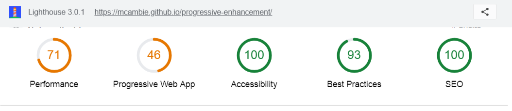

# Progressive-enhancement
## Exercice révision html

- But de l'exercice : Revoir les bases Html
- Durée : 1 jour
- Consignes : [Here](https://github.com/becodeorg/Johnson2/blob/master/02-HTML-CSS/progressive-enhancement/readme.md)
- Page : [Here](https://mcambie.github.io/progressive-enhancement/)
## Test lighthouse

